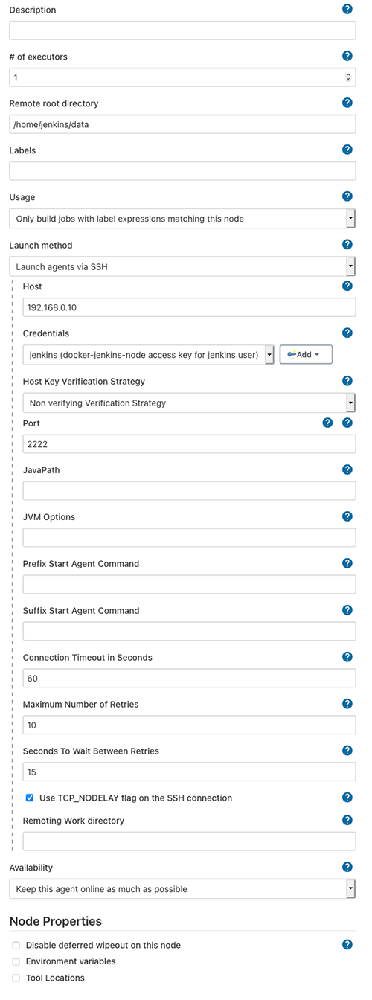

# Jenkins Node/Agent running in a Docker container

This is useful for spinning up a jenkins agent easily without having to
install required software on a bare bones host.

The the [docker-compose.yml] file for example usage.

## Extending

To install any other required packages create your own `Dockerfile`:

```
FROM jc21/jenkins-node

RUN yum -y install nameofmypackage
```

## SSH Keys

This container will start a ssh server. Despite being bad practice for
docker containers, in this case it's required for Jenkins to connect
easily to this host.

SSH logins will only accept an [SSH key](rootfs/home/jenkins/.ssh/id_rsa.key), not a password.

To overwrite the SSH keys in this image, you can either extend with the method above
with new keys or mount new keys within your container.

## Jenkins Node Configuration

Add some SSH credentials to Jenkins with:

- Username: `jenkins`
- SSH Key: [default SSH key here](rootfs/home/jenkins/.ssh/id_rsa.key)

Then configure a new node to connect to your running container:


